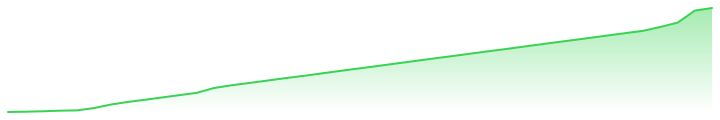

# 📈 daily-pulse

A self-updating record of my public GitHub footprint. A [scheduled Action](.github/workflows/pulse.yml)
runs each morning, queries the GitHub GraphQL API, and rewrites the data files below.
Every number on this page is generated — nothing is typed by hand.



## Today · 2026-08-17

| Metric | Value |
|---|---|
| Contributions (rolling year) | **653** (+7 vs. previous snapshot) |
| Commits | 643 |
| Pull requests | 1 |
| Issues | 0 |
| Public repos | 9 |
| Stars earned | 9 |
| Forks | 0 |
| Followers | 4 |

**Streak:** 11 days current · 11 longest · 46/366 days active
**Busiest day:** 2026-01-18 (124 contributions)

## Trend

Contributions across the last 10 snapshots:

```
▁▁▁▂▂▃▅▆▇█
```

## Repositories

| Repo | ★ | Language | Last push |
|---|---|---|---|
| [Ieee](https://github.com/vanshrana21/Ieee) | 2 | Python | 2026-08-07 |
| [AbyssalDive](https://github.com/vanshrana21/AbyssalDive) | 1 | Lua | 2026-08-07 |
| [Finguru](https://github.com/vanshrana21/Finguru) | 1 | CSS | 2026-01-28 |
| [hackathon-1](https://github.com/vanshrana21/hackathon-1) | 1 | JavaScript | 2026-01-28 |
| [kavach](https://github.com/vanshrana21/kavach) | 1 | HTML | 2026-08-07 |
| [Project-Friday](https://github.com/vanshrana21/Project-Friday) | 1 | TypeScript | 2025-11-17 |
| [vanshrana21](https://github.com/vanshrana21/vanshrana21) | 1 | TypeScript | 2026-08-17 |
| [yoooo](https://github.com/vanshrana21/yoooo) | 1 | — | 2026-07-22 |
| [daily-pulse](https://github.com/vanshrana21/daily-pulse) | 0 | TypeScript | 2026-08-16 |

## Language mix

| Language | Share |
|---|---|
| `Python` | 42.6% █████████ |
| `JavaScript` | 22.5% ████ |
| `CSS` | 13.5% ███ |
| `HTML` | 12.7% ███ |
| `Lua` | 5.0% █ |
| `Luau` | 2.6% █ |
| `TypeScript` | 0.9% █ |
| `Shell` | 0.2% █ |

## Files

| Path | Contents |
|---|---|
| [`data/stats.csv`](data/stats.csv) | one row per day — totals |
| [`data/repos.json`](data/repos.json) | per-repo snapshot |
| [`data/languages.csv`](data/languages.csv) | language bytes over time |
| [`data/stars.csv`](data/stars.csv) | per-repo star history |
| [`data/streak.json`](data/streak.json) | computed streak stats |
| [`assets/trend.svg`](assets/trend.svg) | rendered sparkline |

<sub>Last run: 17 Aug 2026, 9:36 am IST · source: GitHub GraphQL API, public data only</sub>
